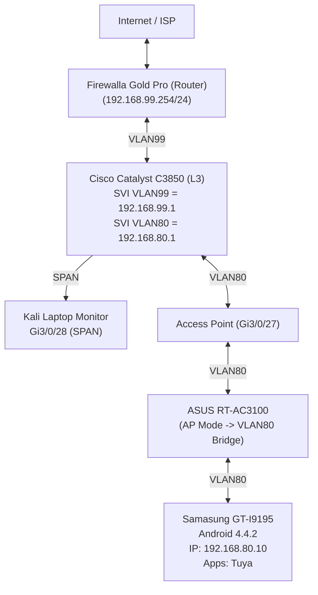

---

```mermaid
flowchart TD
ISP["Internet / ISP"]
FW["Firewalla Gold Pro (Router)
(192.168.99.254/24)"]
SW["Cisco Catalyst C3850 (L3)
SVI VLAN99 = 192.168.99.1
SVI VLAN80 = 192.168.80.1"]
KALI["Kali Laptop Monitor
Gi3/0/28 (SPAN)"]
AP["Access Point (Gi3/0/27)"]
ASUS["ASUS RT-AC3100
(AP Mode -> VLAN80 Bridge)"]
GT["Samasung GT-I9195
Android 4.4.2
IP: 192.168.80.10
Apps: Tuya"]

ISP <--> FW
FW <--> | VLAN99 | SW
SW --> | SPAN | KALI
SW <--> | VLAN80 | AP
AP <--> | VLAN80 | ASUS
ASUS <--> | VLAN80 | GT
```

---
