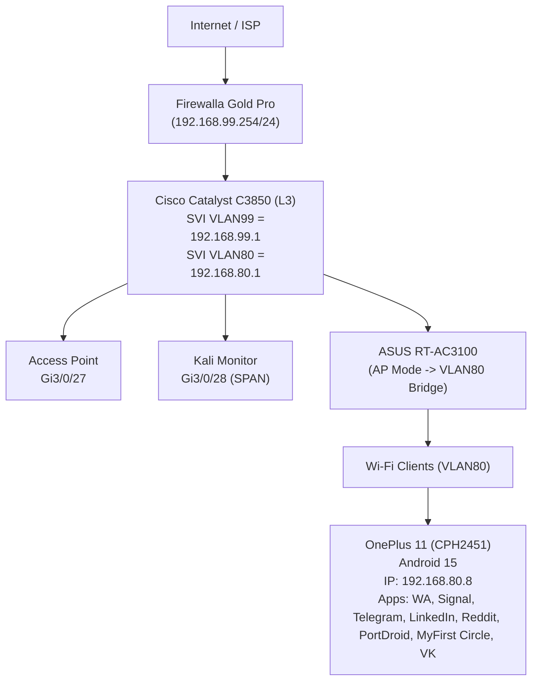

# Setup & Methodology  

### Network Environment  
- **ISP WAN** → Firewalla Pro Gold (Router & NAT device, connected to ISP uplink)  
- **Firewalla Pro Gold** ↔ **Cisco Catalyst 3850 (L3 Switch)**  
  - Uplink **Gi3/0/12** connected to Firewalla (configured as **802.1Q trunk, VLAN99 native**, VLAN80 carried).  
- **Asus Access Point (AP)** connected to Cisco **Gi3/0/27**, bridging wireless clients into **VLAN80** (192.168.80.0/24).  
- **hpKali Laptop (Forensics Station)** connected to Cisco **Gi3/0/28**, designated as **SPAN/mirror destination** from the AP port.  

---



---
                

### VLAN Configuration  
- **VLAN 99** (192.168.99.0/24):  
  - Cisco SVI: `192.168.99.1`  
  - Firewalla: `192.168.99.254`  
  - Purpose: Management / router inter‑VLAN gateway.  

- **VLAN 80** (192.168.80.0/24):  
  - Cisco SVI: `192.168.80.1` (default gateway for wireless clients)  
  - NAT provided by Firewalla (static route for VLAN80).  
  - Purpose: Wireless Android device under test.  

### Cisco Switch (WS-C3850)  
- **SPAN Configuration:**  
  - **Source:** Gi3/0/27 (Asus AP uplink port)  
  - **Destination:** Gi3/0/28 (Kali forensic laptop)  
  - Mode: Monitor session (RX/TX mirrored)  
- **Routing:** Enabled (`ip routing`), with default route via `192.168.99.254`.  
- **NAT:** Handled by Firewalla (Cisco Catalyst does not support NAT in this image).  

### Firewalla Pro Gold  
- Running Linux‑based firmware.  
- Configured static route: `192.168.80.0/24 → 192.168.99.1`.  
- NAT rules confirmed via `iptables` to masquerade 192.168.80.0/24 out ISP uplink.  
- Verification: bidirectional ICMP between Cisco SVI (99.1) and Firewalla (99.254).  

### Access Point (Asus)  
- Mode: Bridge/AP only.  
- Connects wireless clients directly into VLAN80.  
- DHCP allocation provided via Cisco SVI/DHCP pool (gateway/dns: 192.168.80.1).  

### Forensic Capture Station (hpKali Laptop)  
- Host: HP laptop with **Kali Linux (2025.2 rolling)**.  
- NIC: `eth0` configured for reception of SPAN traffic.  
- Tools:  
  - **tcpdump 4.x** → raw capture to `.pcap`  
  - **tshark (Wireshark CLI 4.4.7)** → analysis extraction  
- Storage: Captures stored under `/root/ZEIT8023/`.  
- Example active capture command:  
  ```bash
  sudo tcpdump -i eth0 -nn -s0 -w redteam_ap_capture_<timestamp>.pcap
  ```  

### Device Under Test (Android Phone)  
- Connected via Wi‑Fi AP → VLAN80.  
- Received IP via DHCP: **192.168.80.8**.  
- Test Apps Installed and executed:  
  - WhatsApp  
  - Signal  
  - Telegram  
  - LinkedIn  
  - Reddit  
  - PortDroid (scanner test app)  
  - MyFirst Circle  
  - VK (vk.com, Russian social media)  

---

📌 **Chain of Custody**  
All captures were generated passively (SPAN port, no injection). Files are preserved in original `.pcap` format with SHA‑256 checksums, and working copies processed via **tshark** into `.txt` forensic artifacts.  

```bash
sha256sum redteam_ap_capture_2025-09-01_23-59.pcap dns_only_2025-09-02_00-00.pcap
```

9ceac810064e01135cb727d50230fc6e16eaa44c7dfd2687e37d55a3d98abee6  redteam_ap_capture_2025-09-01_23-59.pcap
0099ca8a749c89d792d77c95f94168f3d11e1f6111e1b1703e61a340912858a2  dns_only_2025-09-02_00-00.pcap

---

```text
┌─────────────────────┐
│     Internet/ISP    │
└──────────┬──────────┘
           │
           │ WAN (100.122.x.x)
           │
┌──────────▼──────────┐
│  Firewalla Gold Pro │  192.168.99.254/24
└──────────┬──────────┘
           │
           │ VLAN99 Trunk
           │
┌──────────▼──────────────────────────────────────────────┐
│              Cisco Catalyst C3850 (L3)                  │
│   SVI VLAN99 = 192.168.99.1   |   SVI VLAN80 = .80.1    │
│                                                          │
│  Gi3/0/27 → Access Point          Gi3/0/28 → SPAN→Kali   │
└──────────┬───────────────────────────────────────────────┘
           │
           │ VLAN80
           │
┌──────────▼──────────┐
│   ASUS RT-AC3100    │  AP Mode → VLAN80 Bridge
└──────────┬──────────┘
           │
           ▼
      Wi-Fi Clients (VLAN80)
           │
           ▼
┌─────────────────────────────────────────────────────────┐
│ OnePlus 11 (CPH2451) — Android 15                       │
│ IP: 192.168.80.8                                         │
│ Apps: WA, Signal, Telegram, LinkedIn, Reddit,           │
│       PortDroid, MyFirst Circle, VK                      │
└─────────────────────────────────────────────────────────┘

```
