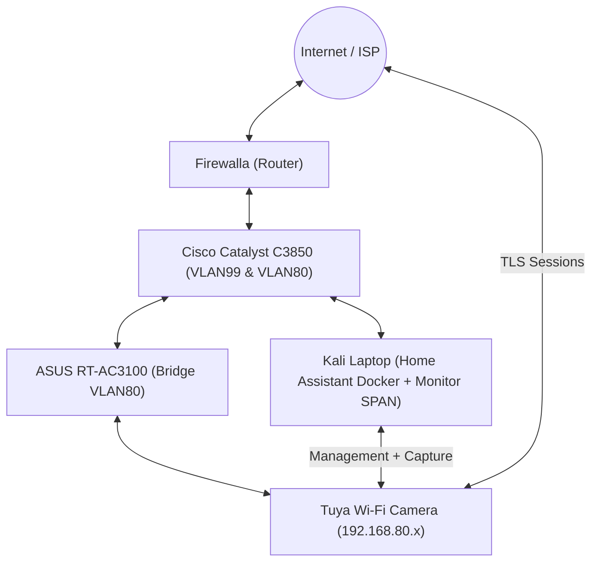

```mermaid
flowchart TD
    Internet((Internet / ISP))
    Router["Firewalla (Router)"]
    Switch["Cisco Catalyst C3850 (VLAN99 & VLAN80)"]
    AP["ASUS RT-AC3100 (Bridge VLAN80)"]
    Laptop["Kali Laptop (Home Assistant Docker + Monitor SPAN)"]
    Cam["Tuya Wi-Fi Camera (192.168.80.x)"]

    Internet <--> Router
    Router <--> Switch
    Switch <--> Laptop
    Switch <--> AP
    AP <--> Cam

    Cam <-->|"TLS Sessions"| Internet
    Laptop <-->|"Management + Capture"| Cam
```

