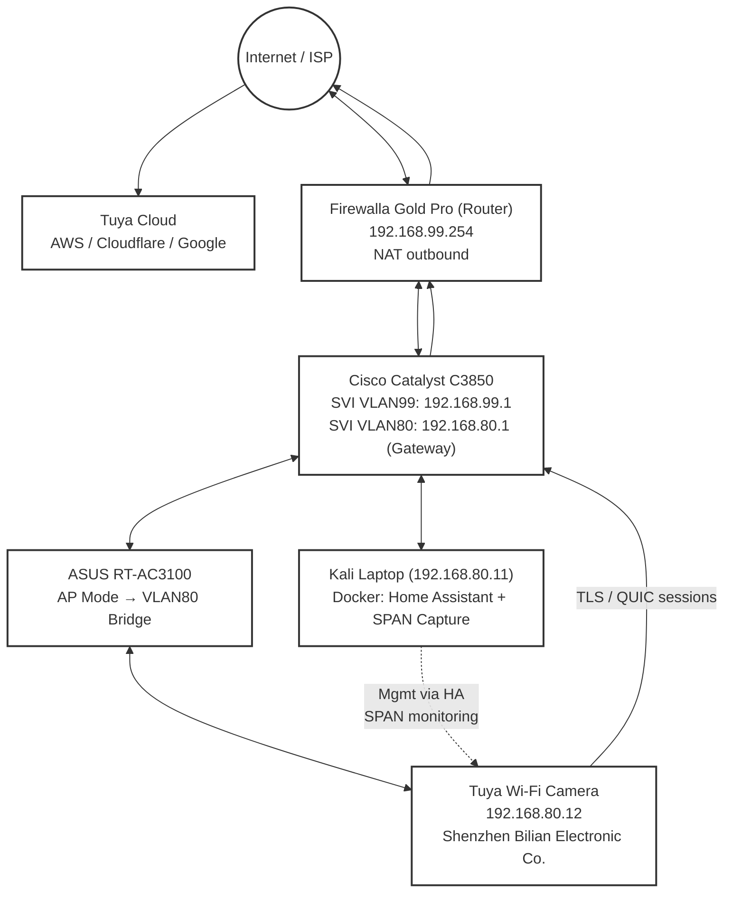

```mermaid
%%{init:{'flowchart':{'nodeSpacing':50,'rankSpacing':80,'htmlLabels':true}}}%%
flowchart TD
    classDef wide fill:#fff,stroke:#333,stroke-width:2px;

    Internet((Internet / ISP)):::wide
    Cloud[Tuya Cloud <br/> AWS / Cloudflare / Google]:::wide
    Router["Firewalla Gold Pro (Router)<br/>192.168.99.254<br/>NAT outbound"]:::wide
    Switch["Cisco Catalyst C3850<br/>SVI VLAN99: 192.168.99.1<br/>SVI VLAN80: 192.168.80.1 (Gateway)"]:::wide
    AP["ASUS RT-AC3100<br/>AP Mode → VLAN80 Bridge"]:::wide
    Laptop["Kali Laptop (192.168.80.11)<br/>Docker: Home Assistant + SPAN Capture"]:::wide
    Camera["Tuya Wi-Fi Camera<br/>192.168.80.12<br/>Shenzhen Bilian Electronic Co."]:::wide

    Internet <--> Router
    Router <--> Switch
    Switch <--> AP
    Switch <--> Laptop
    AP <--> Camera

    Camera -->|"TLS / QUIC sessions"| Switch
    Switch --> Router
    Router --> Internet
    Internet --> Cloud

    Laptop -.->|"Mgmt via HA<br/>SPAN monitoring"| Camera
```

