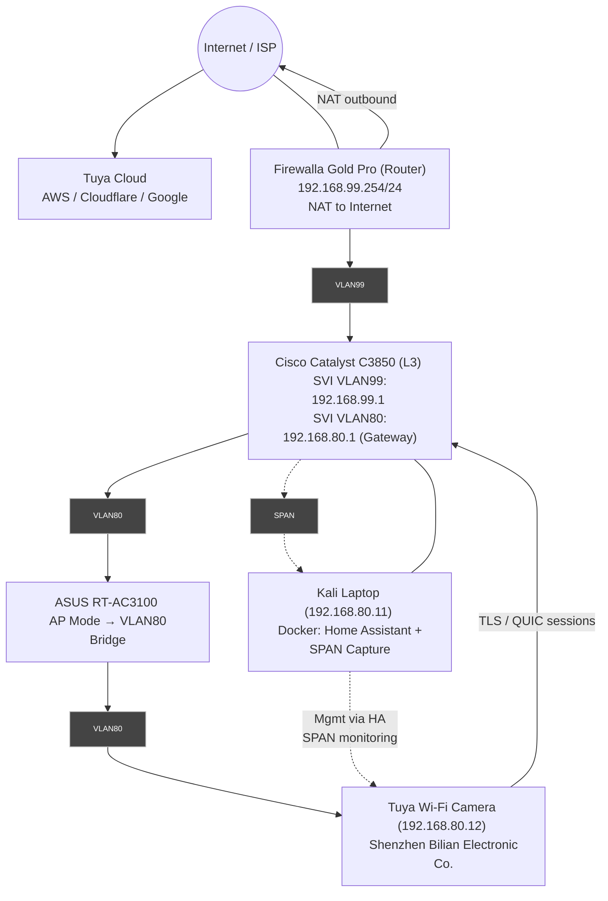

```mermaid
flowchart TD
    Internet((Internet / ISP))
    Cloud["Tuya Cloud <br/> AWS / Cloudflare / Google"]

    Router["Firewalla Gold Pro (Router) <br/> 192.168.99.254/24 <br/> NAT to Internet"]
    Switch["Cisco Catalyst C3850 (L3) <br/> SVI VLAN99: 192.168.99.1 <br/> SVI VLAN80: 192.168.80.1 (Gateway)"]
    AP["ASUS RT-AC3100 <br/> AP Mode → VLAN80 Bridge"]
    Laptop["Kali Laptop (192.168.80.11) <br/> Docker: Home Assistant + SPAN Capture"]
    Camera["Tuya Wi-Fi Camera (192.168.80.12) <br/> Shenzhen Bilian Electronic Co."]

    %% Inline link labels (small boxes)
    v99["VLAN99"]:::tag
    v80a["VLAN80"]:::tag
    v80b["VLAN80"]:::tag
    span1["SPAN"]:::tag

    %% Infra path
    Router --> v99 --> Switch
    Switch --> v80a --> AP
    AP --> v80b --> Camera

    %% Explicit traffic path (gateway then NAT then cloud)
    Camera -->|"TLS / QUIC sessions"| Switch
    Router -->|"NAT outbound"| Internet
    Internet --> Cloud

    %% Mgmt / SPAN path (dashed)
    Switch -.-> span1 -.-> Laptop
    Laptop -.->|"Mgmt via HA <br/> SPAN monitoring"| Camera

    %% Optional backbone links for context
    Internet --- Router
    Switch --- Laptop

    %% Tiny tag-box styling (GitHub-safe)
    classDef tag fill:#444,stroke:#bbb,color:#fff,stroke-width:1px,font-size:10px;


```

