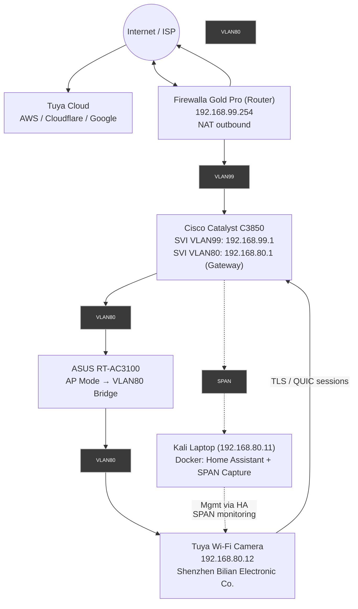

```mermaid
%%{init: {"flowchart": {"htmlLabels": false}}}%%
flowchart TD
    Internet((Internet / ISP))
    Cloud["Tuya Cloud\nAWS / Cloudflare / Google"]
    Router["Firewalla Gold Pro (Router)\n192.168.99.254\nNAT outbound"]
    Switch["Cisco Catalyst C3850\nSVI VLAN99: 192.168.99.1\nSVI VLAN80: 192.168.80.1 (Gateway)"]
    AP["ASUS RT-AC3100\nAP Mode → VLAN80 Bridge"]
    Laptop["Kali Laptop (192.168.80.11)\nDocker: Home Assistant + SPAN Capture"]
    Camera["Tuya Wi-Fi Camera\n192.168.80.12\nShenzhen Bilian Electronic Co."]

    %% tag nodes for link labels
    v99["VLAN99"]:::tag
    v80a["VLAN80"]:::tag
    v80b["VLAN80"]:::tag
    v80c["VLAN80"]:::tag
    span1["SPAN"]:::tag

    %% Core paths
    Internet <--> Router
    Router --> v99 --> Switch
    Switch --> v80a --> AP
    AP --> v80b --> Camera

    %% Camera outbound flows
    Camera -->|"TLS / QUIC sessions"| Switch
    Router --> Internet --> Cloud

    %% SPAN / mgmt path (dashed)
    Switch -.-> span1 -.-> Laptop
    Laptop -.->|"Mgmt via HA\nSPAN monitoring"| Camera

    %% Styling for small inline boxes
    classDef tag fill:#3a3a3a,stroke:#bfbfbf,color:#ffffff,stroke-width:1px,font-size:10px;


```

