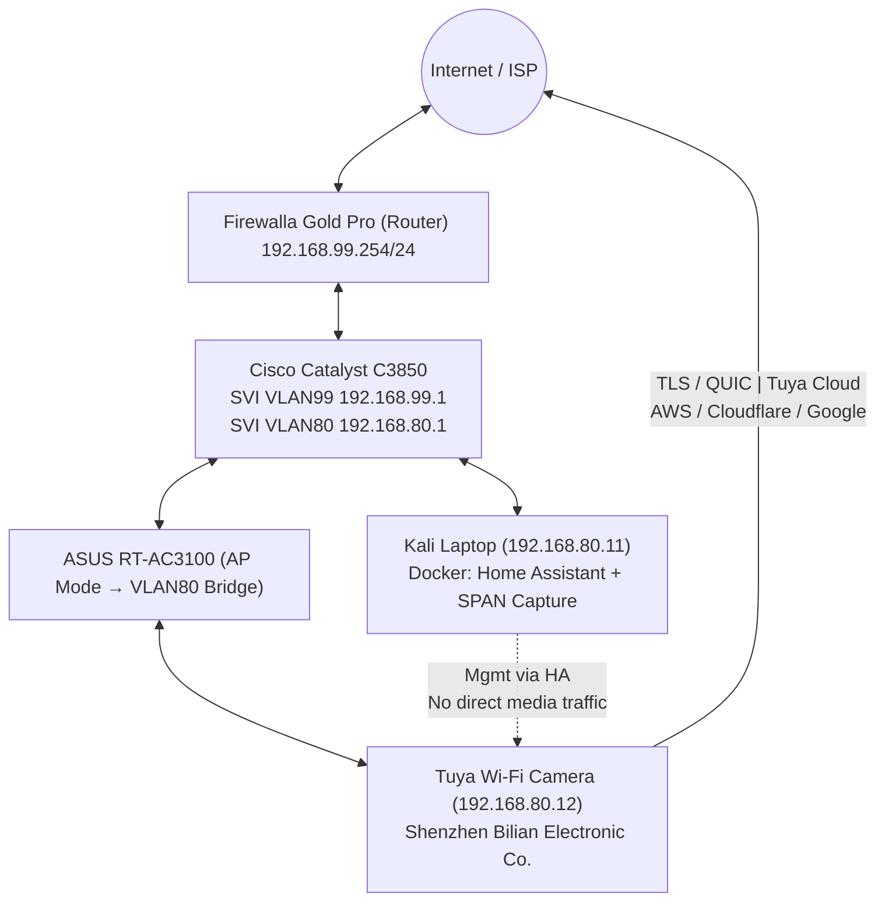

```mermaid
flowchart TD
    Internet((Internet / ISP))
    Router["Firewalla Gold Pro (Router) 192.168.99.254/24"]
    Switch["Cisco Catalyst C3850<br/>SVI VLAN99 192.168.99.1<br/>SVI VLAN80 192.168.80.1"]
    AP["ASUS RT-AC3100 (AP Mode → VLAN80 Bridge)"]
    Laptop["Kali Laptop (192.168.80.11)<br/>Docker: Home Assistant + SPAN Capture"]
    Camera["Tuya Wi-Fi Camera (192.168.80.12)<br/>Shenzhen Bilian Electronic Co."]

    Internet <--> Router
    Router <--> Switch
    Switch <--> Laptop
    Switch <--> AP
    AP <--> Camera

    Camera -->|"TLS / QUIC | Tuya Cloud<br/>AWS / Cloudflare / Google"| Internet
    Laptop -.->|"Mgmt via HA<br/>No direct media traffic"| Camera
```

