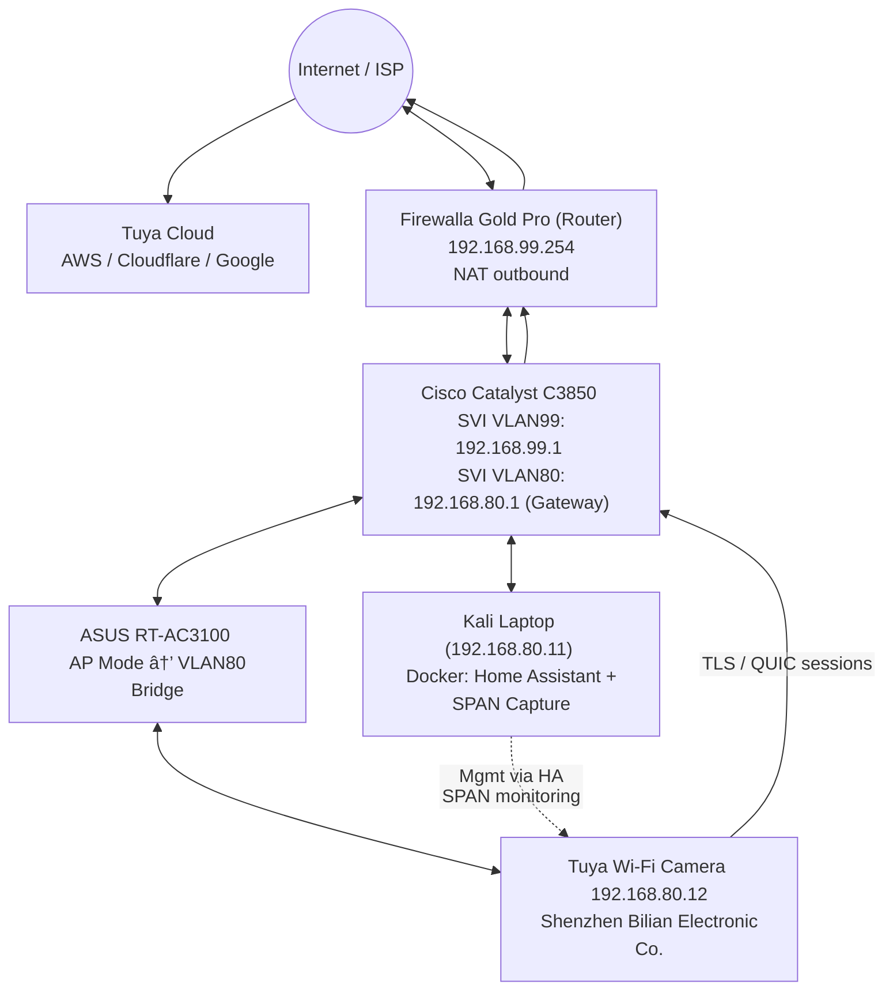

```mermaid
%%{init: {"flowchart": {"htmlLabels": false}}}%%
flowchart TD
    Internet((Internet / ISP))
    Cloud["Tuya Cloud <br/> AWS / Cloudflare / Google"]
    Router["Firewalla Gold Pro (Router) <br/> 192.168.99.254 <br/> NAT outbound"]
    Switch["Cisco Catalyst C3850 <br/> SVI VLAN99: 192.168.99.1 <br/> SVI VLAN80: 192.168.80.1 (Gateway)"]
    AP["ASUS RT-AC3100 <br/> AP Mode → VLAN80 Bridge"]
    Laptop["Kali Laptop (192.168.80.11) <br/> Docker: Home Assistant + SPAN Capture"]
    Camera["Tuya Wi-Fi Camera <br/> 192.168.80.12 <br/> Shenzhen Bilian Electronic Co."]

    %% Infra path
    Internet <--> Router
    Router <--> Switch
    Switch <--> AP
    Switch <--> Laptop
    AP <--> Camera

    %% Camera outbound flows
    Camera -->|"TLS / QUIC sessions"| Switch
    Switch --> Router
    Router --> Internet
    Internet --> Cloud

    %% Mgmt / SPAN path
    Laptop -.->|"Mgmt via HA\nSPAN monitoring"| Camera

```

