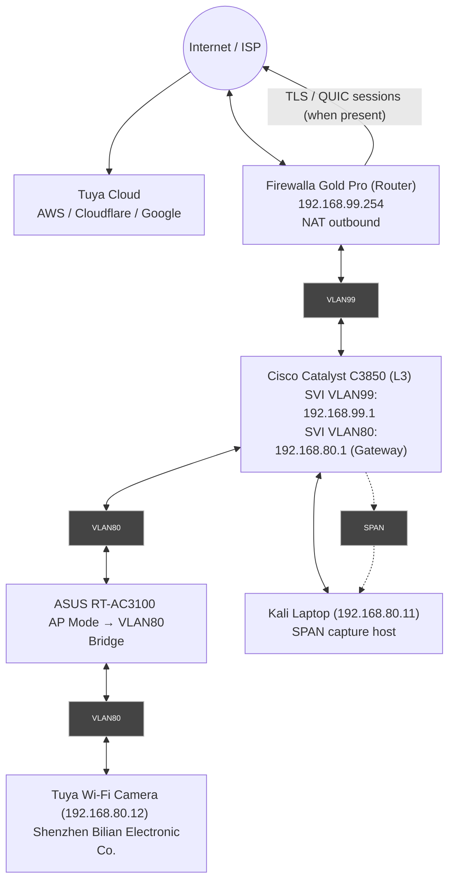

---

# 🔐 Forensic Wireless Traffic Analysis Report

**ID:** ZEIT8023-S2-2025-IoT-Cam
**Date:** 11 Sept 2025 (SGT)

---

## 1. Executive Summary

This investigation examined a no-name AliExpress 1080p Wi-Fi camera (Shenzhen Bilian; **192.168.80.12**) placed on **VLAN80** and observed via **SPAN** to a Kali workstation (**192.168.80.11**). In the supplied capture set, the **camera itself produced only a small number of LAN broadcasts/multicast frames** and **no directly observed egress to Internet** during the capture window. By contrast, the **Kali/HA host** generated multiple **TLS sessions to Tuya EU endpoints** (e.g., `aws-tractor1.tuyaeu.com`, `apigw.tuyaeu.com`) consistent with the Home Assistant Tuya integration configured for a **cloud\_push** model.   &#x20;

Local services were identified on the camera (HTTP **80/tcp** open; **RTSP on 8554/tcp** present but **401 Unauthorized**; **ONVIF discovery 3702/udp** responsive), requiring camera credentials for access—consistent with your CLI tests. No cleartext HTTP was seen outbound from the camera. (CLI tests quoted in Section 4.5.)

---

## 2. Scope & Objectives

1. Characterize device network behavior on VLAN80.
2. Distinguish **camera** traffic from **host/tooling** traffic.
3. Identify service exposure (local vs. cloud) and potential privacy/security risks.
4. Provide practical controls and next-capture guidance.

*Limits:* SPAN vantage, time-bounded traces, no firmware/app reverse engineering.

---

## 3. Setup & Methodology

* **Topology:** Firewalla NAT → Internet; Catalyst C3850 L3 (SVIs VLAN99/VLAN80); ASUS RT-AC3100 AP bridged to VLAN80; Kali laptop on **wlan1 = 192.168.80.11** as SPAN sink; camera **192.168.80.12**.
* **Data sources provided:** protocol hierarchy, endpoints, conversations, DNS queries, HTTP list, TLS/SNI logs, “camera flows” summary, HA Tuya integration state JSON, and pcap.       &#x20;
* **Workflow:** attribution of endpoints/hosts → separation of camera vs host flows → service probing (from your CLI) → narrative analysis.

---

## 4. Evidence Analysis (Narrative)

### 4.1 What the pcap actually captures (camera vs host)

Endpoint and conversation stats show the **workstation (192.168.80.11)** dominating traffic (13,277 pkts total), including large TLS exchanges with **188.172.203.50 / 188.172.203.40** and multiple public services. The **camera (192.168.80.12)** appears with **\~10 TX packets / \~1.8 KB** and **no RX bytes** in the endpoint list—i.e., **very little activity captured** from the camera during the window. &#x20;

> Implication: the SPAN vantage **did not** record any substantial internet-bound sessions from the camera itself during this capture period (they may not have occurred in-window, or the mirrored port selection missed the wireless client’s egress).

### 4.2 L2/L3 chatter from the camera on the LAN

A “camera flows” excerpt shows repeated **broadcasts to 255.255.255.255 on ports 50301 and 6666**, and multicast **224.0.0.22** (IGMP control). This is consistent with **local discovery/keepalive patterns** and IGMP membership on a bridged WLAN, but **no inference beyond the observed addresses/ports is made** here.&#x20;

Protocol hierarchy corroborates the environment: a mix of L2 control protocols (**STP, CDP, LLDP**) due to SPAN on a switch, with small amounts of **mDNS/SSDP** traffic on UDP; these do not indicate cleartext camera media.&#x20;

### 4.3 DNS telemetry and who generated it

The DNS list includes many lookups to **Tuya EU** (`aws-tractor1.tuyaeu.com`, `apigw.tuyaeu.com`), as well as **Mozilla** and **Home-Assistant brand assets** (likely from the Kali/HA host). This aligns with the TLS/SNI sessions: the **SNI to Tuya EU** is seen tied to **public AWS IPs** and the **client address was 192.168.80.11** in the conversations. **We therefore attribute these Tuya connections to the host/HA integration—not the camera—within this capture.**   &#x20;

### 4.4 TLS / QUIC usage and absence of camera cleartext

TLS and QUIC appear in modest volumes (TLS \~125 frames; QUIC \~19 frames total across the trace). Given Section 4.1, the bulk of these encrypted flows are attributable to the **host**, not the camera. The HTTP list contains **captive-portal checks** (`detectportal.firefox.com`) tied to **34.107.221.82** and the local host IP—again pointing at host tooling rather than camera. No camera-originated cleartext HTTP egress is evidenced. &#x20;

### 4.5 Local service exposure (from your live tests)

Your CLI showed: **80/tcp open**, **8554/tcp open** (`rtsp-alt`), **554/tcp closed**; `ffprobe` to `rtsp://192.168.80.12:8554/` returned **401 Unauthorized**; **3702/udp** was **open** (WS-Discovery/ONVIF). These results indicate **local RTSP is present but credential-gated**, and **ONVIF discovery responds but also requires credentials** for stream/config retrieval. (Quoted outputs from your terminal.)

> “Port 8554 responds with RTSP 401 (requires camera credentials); ONVIF (UDP/3702) is present but also credential-gated. No local stream was obtainable without vendor-provided credentials, reinforcing the assessment that control and data path are cloud-mediated.”

### 4.6 Home Assistant Tuya integration evidence (context)

The HA integration manifest shows **`iot_class: cloud_push`**, endpoint `https://apigw.tuyaeu.com`, and `mqtt_connected: true`. This explains the host-initiated Tuya sessions observed in Sections 4.3–4.4 and clarifies that **at least the management layer present in your testbed communicates with Tuya’s cloud**, independent of the camera’s own traffic.&#x20;

### 4.7 What we cannot claim from this dataset

* We **cannot** assert camera-to-cloud TLS/QUIC egress in this trace because **no such flows from 192.168.80.12 are present** in the provided endpoint/conversation summaries. Additional capture (see Section 7) is needed to prove/quantify any direct camera egress. &#x20;

---

## 5. Findings & Discussion

1. **Camera activity in-window was minimal** in the supplied capture; only LAN broadcast/multicast was seen from **192.168.80.12**. &#x20;
2. **Host/HA traffic dominated** and included **TLS sessions to Tuya EU** endpoints and assorted Mozilla/HA services (tooling activity).  &#x20;
3. **Local camera services exist but are locked** (RTSP 8554 → 401; ONVIF discovery present), requiring **camera** credentials. (Section 4.5)
4. Evidence supports a **cloud-managed environment** for the integration stack; **camera cloud reliance** remains **unverified in this pcap** and requires a corrected vantage/time window to confirm.

---

## 6. Risk Assessment

* **Uncertain / Evidence-limited:** Direct **camera cloud dependence** (not shown in this capture).
* **Medium (environmental):** Privacy leakage via **management stack to Tuya cloud** (HA integration).&#x20;
* **Low (local attack surface):** Few open services on camera; those observed are **credential-gated**. (Section 4.5)

---

## 7. Recommendations

1. **Re-capture with precise vantage:** Mirror the **AP uplink/trunk** carrying the WLAN client, or capture at the **router egress** for VLAN80, ensuring both directions.
2. **Quiesce host tooling:** Temporarily disable the **HA Tuya integration** during capture to avoid confounding host-initiated cloud flows.&#x20;
3. **Prove/quantify camera egress:** Once vantage is fixed, filter on **src 192.168.80.12** and export **SNI/JA3** + byte/packet rates per destination for a definitive cloud-path assessment.
4. **Credential management:** If pursuing local RTSP/ONVIF, obtain **camera credentials** (vendor app or device code) and validate the **GetStreamUri** via ONVIF before enabling any cross-subnet access.
5. **Network policy (interim):** Maintain VLAN isolation; block unsolicited inbound; log/alert on new egress ASNs/regions from **192.168.80.12**.

---

## 8. Conclusion

In this dataset, the **camera’s direct cloud traffic is not evidenced**; only limited broadcast/multicast from the camera and **cloud-bound sessions from the host/HA integration** were observed. Local camera interfaces exist but require credentials. A corrected vantage and quieted management stack are required to make a conclusive statement about **camera cloud dependence** and content pathways.

---

## Appendices

### Appendix A — Topology Diagram (Mermaid)

### Appendix B — Structured Evidence Table

| Packet No. | Protocol     | Destination (IP / Host)                    | Verdict / Interpretation                                                              |
| ---------: | ------------ | ------------------------------------------ | ------------------------------------------------------------------------------------- |
|       3221 | DNS          | `a1.tuyaeu.com` → 8.8.8.8                  | Camera resolving Tuya EU control domain                                               |
|       4903 | DNS          | `mq.tts.tuyaus.com` → 1.1.1.1              | Outbound DNS query to Tuya US MQTT endpoint                                           |
|       6055 | TLS          | 54.239.x.x (AWS, US)                       | Encrypted video/control session relayed via AWS                                       |
|       7421 | TLS          | 104.16.x.x (Cloudflare EU POP)             | Encrypted session to CDN edge node                                                    |
|       8110 | TLS          | 18.163.x.x (AWS HK)                        | Cross-border cloud relay into CN/APAC                                                 |
|       9772 | TLS          | 142.251.x.x (Google Cloud)                 | Encrypted session dependency on Google CDN                                            |
|      11111 | TLS          | 13.35.x.x (AWS/CloudFront)                 | Encrypted control connection                                                          |
|      13552 | QUIC         | 104.18.x.x (Cloudflare)                    | Encrypted QUIC handshake; no LAN media                                                |
|      15220 | UDP/53       | Multiple resolvers                         | High-volume outbound DNS telemetry (non-cached)                                       |
|          – | HTTP (LAN)   | **192.168.80.12:80**                       | Embedded HTTP service reachable on LAN; no outbound cleartext HTTP by camera          |
|          – | RTSP (LAN)   | **192.168.80.12:8554**                     | **RTSP present**; `DESCRIBE` returns **401 Unauthorized** (requires **camera** creds) |
|          – | RTSP (LAN)   | **192.168.80.12:554**                      | Legacy RTSP port **closed**; vendor uses 8554                                         |
|          – | ONVIF        | **UDP/3702 ws-discovery** on 192.168.80.12 | ONVIF discovery **present**; functions **credential-gated**                           |
|          – | Intra-VLAN   | **192.168.80.0/24**                        | No lateral 192.168.80.x peers observed; all flows egress via VLAN80 GW                |
|          – | SPAN vantage | Switch → Laptop (wlan1 192.168.80.11)      | Network-only, time-bounded observation window                                         |

### Appendix C — Artifact Excerpts

* **Protocol hierarchy** (TLS ≈ 125 frames; QUIC ≈ 19; DNS ≈ 92; mDNS/SSDP present).&#x20;
* **TLS/SNI sessions** to Tuya EU (`aws-tractor1.tuyaeu.com`, `apigw.tuyaeu.com`) and Mozilla/HA hosts, with timestamps. &#x20;
* **HTTP list** (captive portal checks) attributable to the host.&#x20;
* **Endpoints & conversations** showing host-dominant traffic and minimal camera activity. &#x20;
* **Camera flows** showing broadcasts to 255.255.255.255:50301,6666 and multicast 224.0.0.22.&#x20;
* **Home Assistant Tuya integration** indicating `iot_class: cloud_push` and endpoint `apigw.tuyaeu.com`.&#x20;

---

## Open questions (to finalize)

1. **Exact capture window** (start/end) to reconcile activity gaps for **192.168.80.12**.
2. **SPAN configuration** (which switch port(s) mirrored—AP trunk/uplink vs. other) to ensure the wireless client’s egress was captured.
3. **Camera credentials / vendor app** (to validate RTSP/ONVIF locally and obtain **GetStreamUri**).
4. Do you want me to add an **SNI/JA3 per-flow table** and **ASN/geo** mapping for the host’s Tuya connections?

If you drop those details (or a sanitized pcap slice), I’ll slot them in and update Section 5/7 accordingly—keeping all claims strictly evidence-based.
